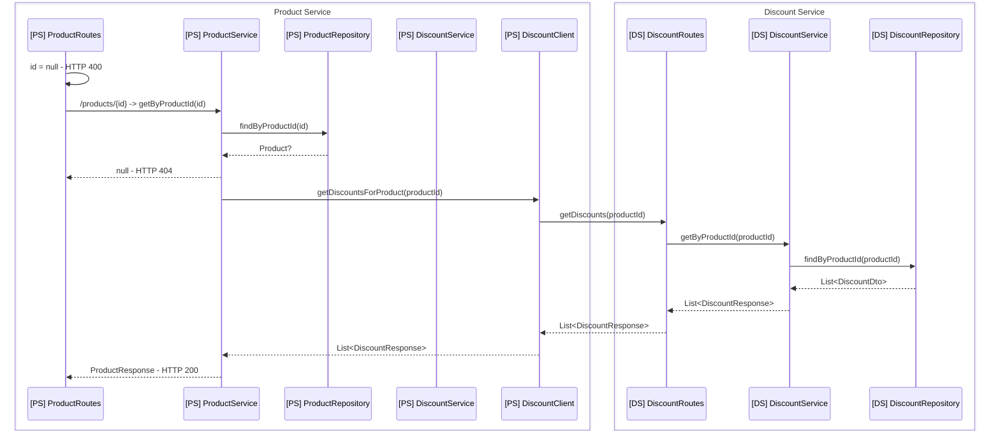
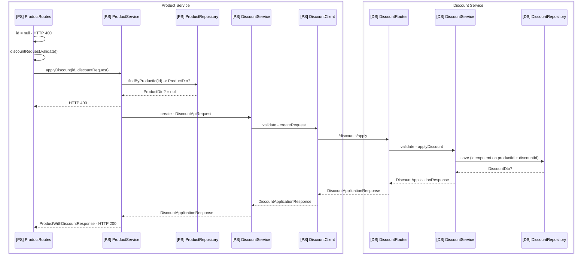
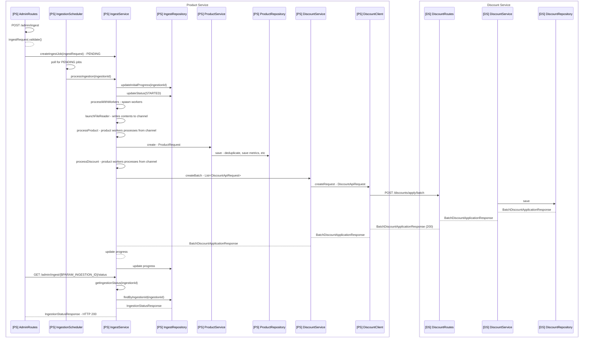
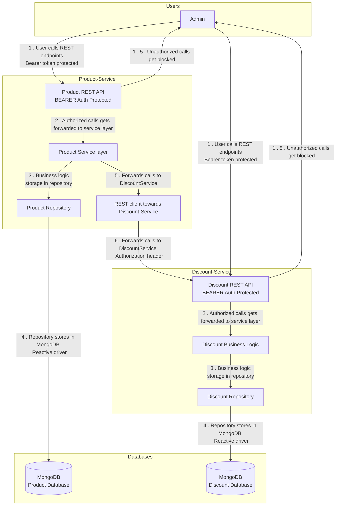

# Mermaid diagrams for various flows:

The flows are roughly like as follows:

PS = Product Service

DS = Discount Service

# 1. GET /products endpoints

# 2. POST /products/{id}/discount endpoint

3. Ingestion start → parse → validate → write → status

I am interpreting this one as the ingestion flow start until the ingestion gets status STARTED and ingestions starts
with IngestMode = ALL

# Component diagram showing the two services and their communication

