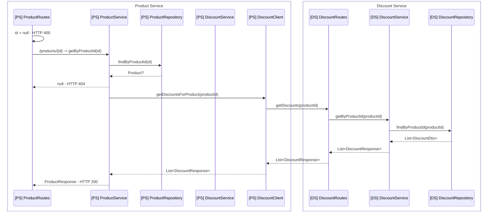
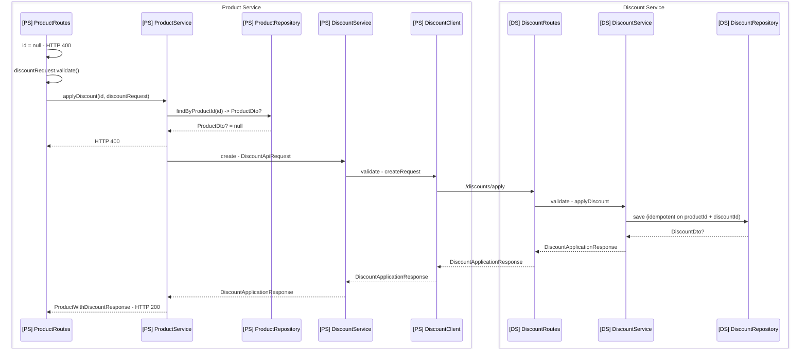
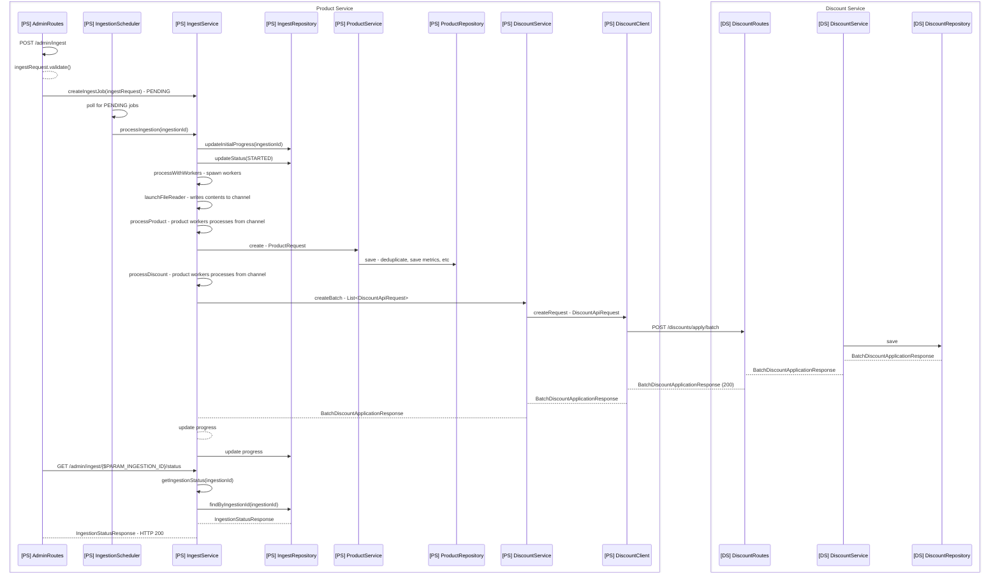
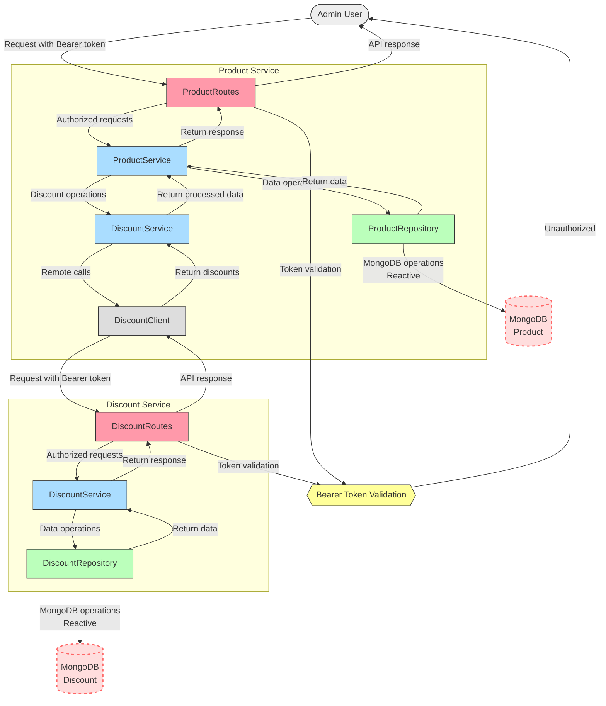

# Design and trade-offs

## General design

Generally the design of the services is quite straight forward: There are these main components:

- Routes - Ktor routes for the various APIs
- Services - Business logic for the various operations
- Repositories - Data access layer, here the MongoDB specific code is located
- Models - DTOs and data models for the various entities
- Clients - For the product service, the client to communicate with the discount service

The services are configures through the `application.yaml` file

## Notes

For this assignment i started out quite simple by starting out with the product-service with the product APIs.
I decided early on to use MongoDB instead of just in-memory storage, as it would be more realistic and also
give me the opportunity to use reactive programming with the MongoDB reactive driver. Mostly due to my own learning and
it sounded more fun.

Once the product APIs where working well enough I started on the ingestion flow. I used this as an opportunity to learn
more about coroutines first and foremost. I did admittedly not have a very clear design for this part which punished me
with the time constraints.

In the beginning i made sure to have the dry run and failFast logic working well, but as i
progressed with the discount service and the ingestion flow, the performance naturally was not there as discount
ingestion was done one discount at a time, causing a large amount of overhead. I did not take this into consideration
early
enough and thus did not have time to both implement batch processing, and also make the ingestion flow work
well enough supporting dry-run and failFast in a sufficient manner. However, I am somewhat satisfied with the regular
ingestion flow's performance as a result of the batch based ingestion.

I have notably not spent the time on implementing unit tests or integration tests, which would naturally have been done
if this would have been a production system with more time available to work on it. This also made me suffer a bit as I
of course had no efficient way of refactoring and fixing the variations in ingestion parameters, for example.

For the bearer token authentication I have configured them statically through environment
variables / application.yaml. They are not propagated from the request to the downstream calls through an interceptor,
mostly due to it being service to service communication, which made sense.

I also added basic pageable fetch APIs for both products and discounts, to make it easier to inspect and verify the
ingested data.

Overall I kind of juggled around with simply seeing how well "vibe coding" would work here, which caused a bit of a mess
to be honest. I regret not taking a more design oriented approach from the start, but was also eager to start and finish
the assignment. Had I had more time I'd try to approach this with a more "spec driven" approach rather than just trying
out vibe coding it all the way either (especially after getting the discount ingestion performant enough)

All in all a good learning opportunity and I have quite enjoyed working with ktor. This is the most amount of ktor
related code I have written so in that sense I am fairly satisfied. Generally was a pretty fun assignment to work on,
but this solution does not quite reach the level of quality I would have liked to have it at.

Will however continue with using ktor in personal projects in the future, I suspected I would like it and I appears that
I do :)

# Mermaid diagrams for various flows:

The flows are roughly like as follows, does not quite include all error handling and validation steps for brevity.:

### 1. GET /products endpoints

### 2. POST /products/{id}/discount endpoint

### 3. Ingestion start → parse → validate → write → status

I am interpreting this one as the ingestion flow start until the ingestion gets status STARTED and ingestions starts
with IngestMode = ALL

## Component diagram showing the two services and their communication

The general data flows look like this, excluding specifics such as the ingestion related internal Product-service
components.

